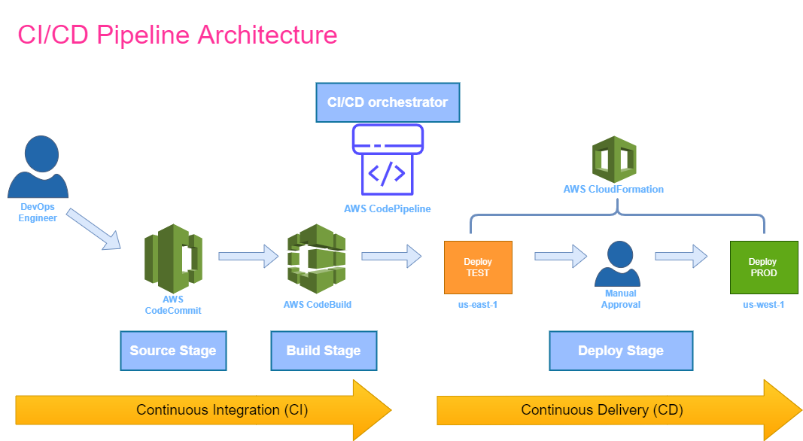

# three-stage-pipeline

CI/CD pipeline for multi-region (us-east-1/N.Virginia and us-west-1/N.California) deployment with AWS CodePipeline

Building three-stage pipeline to deploy web application with CloudFormation template.
- Version 1: Using AWS CodeCommit and AWS CodePipeline.
- Version 2: Using GitHub and AWS CodePipeline.

Used cfn-lint tool to test the template on the build stage.

# diagrams:

- Version 1: Source stage - AWS CodeCommit

- Version 2: Source stage - GitHub
